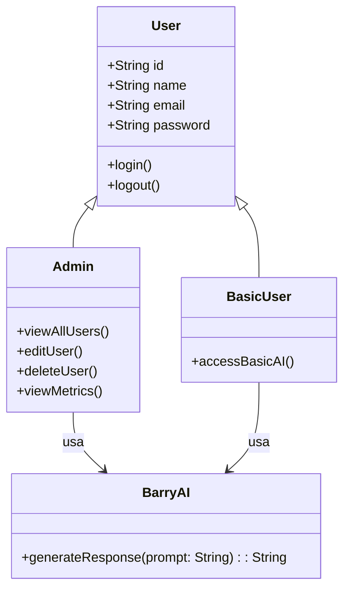
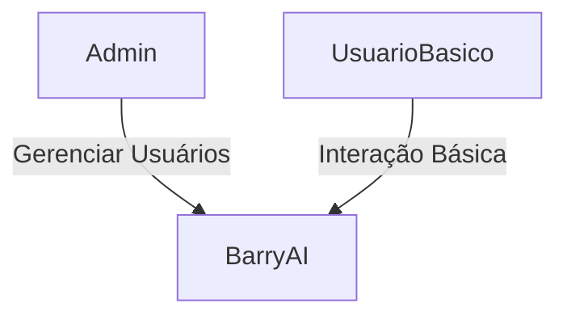
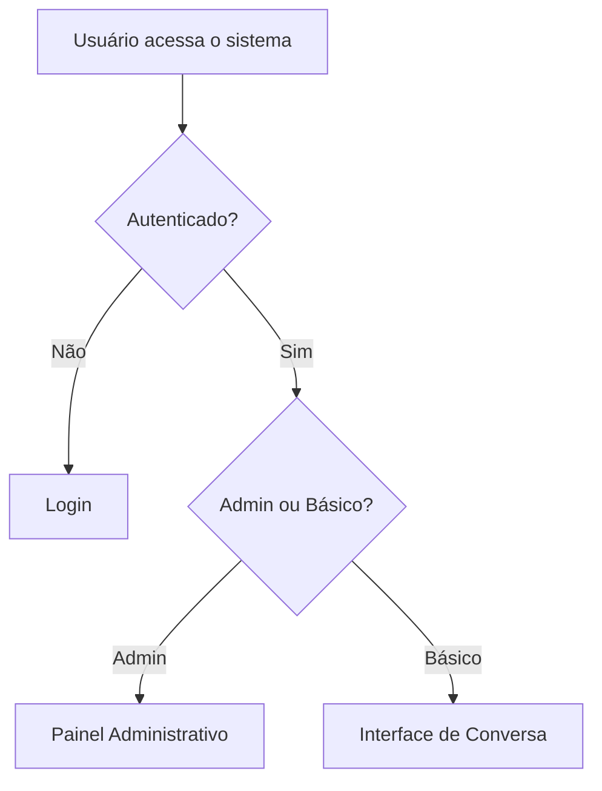

<div align="center">


</div>

> **Uma IA acessível para todos.**

BarryAI é um **chatbot inteligente** desenvolvido com foco em **usabilidade e inclusão digital**, projetado especialmente para pessoas com dificuldades tecnológicas, limitações físicas ou cognitivas, idosos e usuários em geral que precisam de uma interface simples e intuitiva.

---

## 🧩 Problematização

No mundo atual, a tecnologia é fundamental para educação, trabalho, serviços públicos e comunicação. Entretanto, muitas pessoas ainda enfrentam limitações no uso dessas ferramentas — seja por falta de familiaridade, dificuldades cognitivas, barreiras sensoriais ou interfaces complexas.

Crianças e adolescentes, por exemplo, têm usado IA cada vez mais cedo, enquanto milhões enfrentam desafios como TDAH, dificultando o uso de plataformas tradicionais. Já idosos vivem uma divisão entre curiosidade e desconfiança em relação à IA, muitas vezes motivada por interfaces pouco acessíveis e comunicações confusas.

Diante desse cenário, torna-se essencial criar soluções **verdadeiramente inclusivas**, capazes de se adaptar a diferentes níveis de habilidade tecnológica e promover autonomia.

BarryAI nasce para ser uma IA empática, simples e acessível — ajudando a tecnologia a ser ponte, e não barreira.

---

## 🎯 Objetivo

Tornar a interação com inteligência artificial **acessível, segura e produtiva** para pessoas de todas as idades e níveis de familiaridade com tecnologia.

---

## 👥 Tipos de Usuários

| Tipo de Usuário    | Acesso                                                                                                                          |
| ------------------ | ------------------------------------------------------------------------------------------------------------------------------- |
| **Admin**          | - Gerencia todos os usuários<br>- Acesso total ao sistema<br>- Visualiza métricas e histórico<br>- Pode editar e excluir contas |
| **Usuário Básico** | - Acesso às funcionalidades essenciais da IA<br>- Interface simplificada e acessível                                            |

---

## 📋 Requisitos do Sistema — BarryAI

### ✅ **Requisitos Funcionais (RF)**

| ID        | Descrição                                                                                             |
| --------- | ----------------------------------------------------------------------------------------------------- |
| **RF-01** | O sistema deve permitir o cadastro de novos usuários com nome, e-mail e senha.                        |
| **RF-02** | O sistema deve permitir login seguro com autenticação por e-mail e senha.                             |
| **RF-03** | O sistema deve diferenciar usuários entre: **Admin** e **Usuário Básico**.                            |
| **RF-04** | O **Admin** deve poder visualizar, editar e excluir contas de todos os usuários.                      |
| **RF-05** | O **Admin** deve ter acesso a métricas, histórico e configurações gerais.                             |
| **RF-06** | O **Usuário Básico** deve poder interagir com o BarryAI com recursos essenciais.                      |
| **RF-07** | O sistema deve registrar o histórico de conversas do usuário, visível apenas para ele e para o Admin. |
| **RF-08** | O sistema deve oferecer interface clara, limpa e intuitiva, acessível a usuários iniciantes.          |
| **RF-09** | O sistema deve validar e-mails e senhas fortes durante o cadastro.                                    |

---

### 🛡️ Requisitos Não Funcionais (RNF)

| ID         | Categoria           | Descrição                                                                                  |
| ---------- | ------------------- | ------------------------------------------------------------------------------------------ |
| **RNF-01** | Usabilidade         | Interface intuitiva e simples para qualquer nível de habilidade.                           |
| **RNF-02** | Acessibilidade      | Seguir diretrizes **WCAG 2.1**, incluindo contraste adequado e suporte a leitores de tela. |
| **RNF-03** | Desempenho          | O tempo de resposta não deve exceder **5 segundos** em 95% das requisições.                |
| **RNF-04** | Segurança           | Senhas com hash (bcrypt) e autenticação JWT.                                               |
| **RNF-05** | Privacidade         | Histórico de conversas criptografado em trânsito e em repouso.                             |
| **RNF-06** | Confiabilidade      | Disponibilidade mínima de **99%** durante horários comerciais.                             |
| **RNF-07** | Escalabilidade      | Suporte para até **10.000 usuários simultâneos**.                                          |
| **RNF-08** | Compatibilidade     | Suporte aos principais navegadores (Chrome, Firefox, Edge, Safari).                        |
| **RNF-09** | Manutenibilidade    | Código modular, documentado e com testes unitários básicos.                                |
| **RNF-10** | Internacionalização | Suporte a **Português (BR)** e **Inglês**.                                                 |

---

## 🛠️ Tecnologias Utilizadas

### Backend (Python + Node.js)

* Python → integração com IA
* Node.js + Express → API
* MongoDB + Mongoose → Banco de dados
* JWT → Autenticação
* Bcrypt → Hash de senhas
* Express Validator → Validação de dados

### Frontend (Angular)

* Angular CLI
* RxJS
* AuthGuard
* HTML/CSS responsivos e acessíveis

### Ferramentas

* Figma (UI)
* Documentação via README e Word
* Integração com modelo de IA principal do projeto

---

## 📊 Diagramas

### 1. **Diagrama de Classes (sem plano Premium)**



---

### 2. **Caso de Uso Simplificado**



---

### 3. **Fluxo de Interação**



---

## 🚀 Como Rodar o Projeto

### Pré-requisitos

* Node.js 18+
* Python 3.9+
* MongoDB
* API de IA habilitada

### Backend

```bash
cd backend
npm install
npm run dev
```

### Frontend

```bash
cd frontend
npm install
ng serve
```

---

## 📜 Licença

Projeto privado — MVMP.
Todos os direitos reservados.